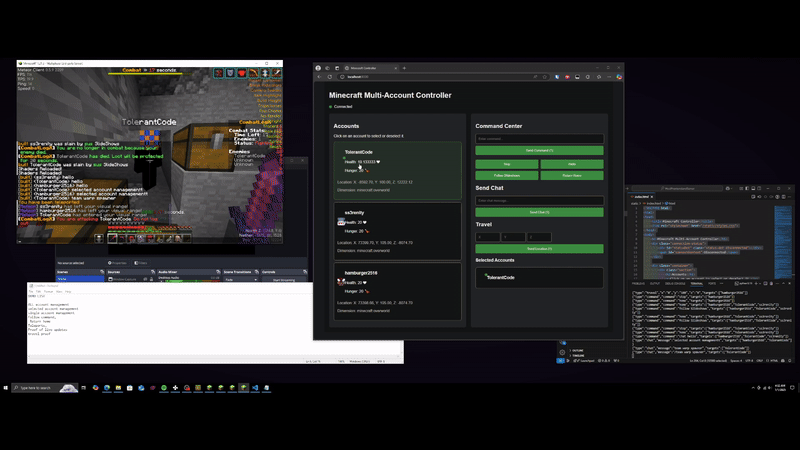

# Minecraft Multi-Account Controller

A comprehensive solution for controlling multiple Minecraft accounts through a web interface. This project combines a FastAPI backend server, an intuitive web dashboard, and a Fabric mod client to enable seamless multi-account management.

## Features Demonstration

### Connection Process
https://github.com/[your-username]/[repository]/assets/[your-id]/connection_demo.mp4

<div align="center">
  <p><i>Seamless connection between Minecraft clients and the control center</i></p>
</div>

### Live Status Updates

<div align="center">
  <p><i>Real-time status updates showing player health, position, and dimension</i></p>
</div>

### Multi-Account Management

<div align="center">
  <p><i>Control multiple Minecraft accounts simultaneously</i></p>
</div>

### Single Account Control

<div align="center">
  <p><i>Precise control over individual accounts</i></p>
</div>

### Travel Functionality

<div align="center">
  <p><i>Coordinate-based travel system for precise player movement</i></p>
</div>

### Web Interface

<div align="center">
  <p><i>Clean and intuitive web dashboard for account management</i></p>
</div>

## Features
- Real-time monitoring of multiple Minecraft accounts
- Live status updates including:
  - Player position (X, Y, Z coordinates)
  - Health and hunger levels
  - Current dimension
- Command execution across multiple selected accounts
- Chat message broadcasting
- Location targeting system
- Quick command presets
- Visual account selection interface

## Technical Stack
<div align="center">
  
  
  
  
</div>

## Setup

### Prerequisites
- Python 3.7+
- Fabric Loader for Minecraft
- Java Development Kit (JDK)

### Installation

1. **Server Setup**
```bash
pip install fastapi uvicorn websockets
```

2. **Minecraft Mod Installation**
- Place the mod JAR file in your Minecraft mods folder
- Ensure Fabric Loader is installed

3. **Starting the Server**
```bash
python main.py
```

4. **Accessing the Web Interface**
- Open a web browser and navigate to `http://localhost:8000`

## Development Journey
This project was developed as part of my high school portfolio to demonstrate:
- Full-stack development capabilities
- Real-time web socket implementation
- Minecraft mod development
- User interface design
- System architecture planning

## Future Improvements
- Add user authentication system
- Implement macro recording functionality
- Add custom scripting support
- Expand command preset library
- Add multi-server support

## Skills Demonstrated
- Backend Development (Python/FastAPI)
- Frontend Development (HTML/CSS/JavaScript)
- WebSocket Programming
- Java Development (Minecraft Modding)
- Real-time System Design
- User Interface Design
- Technical Documentation

## Contact
[Your Name] - [Your Email/GitHub Profile]